# 🎬 NekoAI in action

A visual tour of NekoAI across all supported desktops. Every clip is a
real recording — no marketing slide art.

> Cross-platform note: NekoAI runs natively on Windows, macOS and Linux
> (Xorg and Wayland). The shipped behaviour is identical; only the
> surrounding desktop chrome changes between OSes.

---

## 🪄 Onboarding

First-launch flow. NekoAI walks out of its house, announces itself, and
auto-configures the AI provider with zero typing — either a local
Ollama install or a free NVIDIA NIM key.

| Windows · Ollama (local)                                                                   | Windows · NVIDIA NIM                                                                           |
| ------------------------------------------------------------------------------------------ | ---------------------------------------------------------------------------------------------- |
| 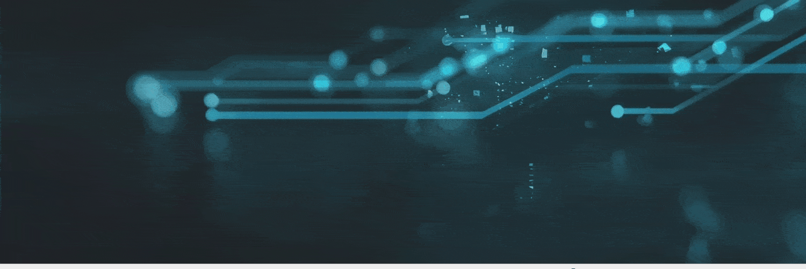 | 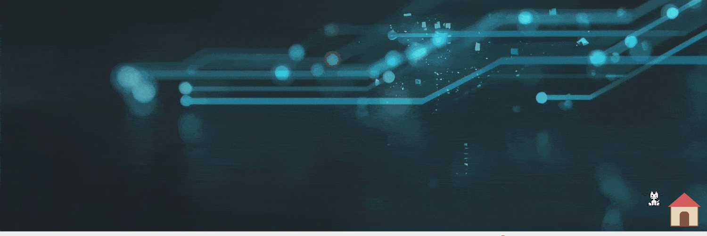 |

---

## 💬 Chat

Animated speech bubble with typewriter reveal, conversation memory, and
provider-routed responses.

| Windows                                                      | macOS                                                    |
| ------------------------------------------------------------ | -------------------------------------------------------- |
| 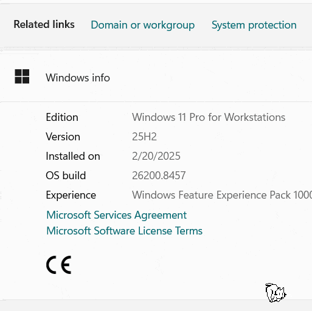 | 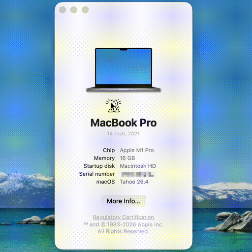 |

| Ubuntu (Linux/Xorg)                                        | Fedora (Linux/Wayland)                                     |
| ---------------------------------------------------------- | ---------------------------------------------------------- |
|  | 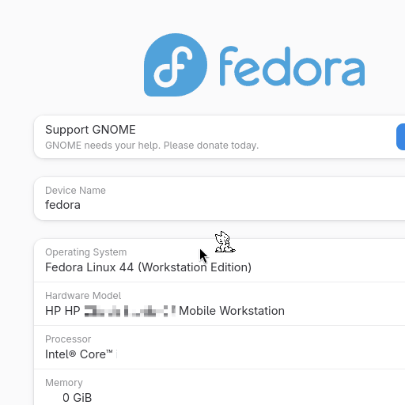 |

---

## 🐾 Select pet

Right-click → Select Pet to switch between the bundled companions
(Classic Neko, Ghost, Ember, Pingu, Shiba, and more).

| Windows                                                                  | Ubuntu                                                                 |
| ------------------------------------------------------------------------ | ---------------------------------------------------------------------- |
| 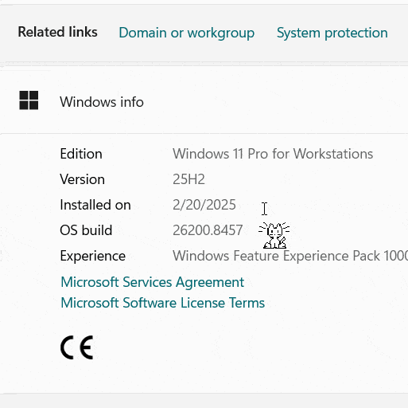 | 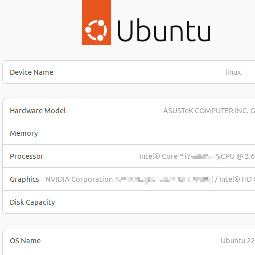 |

| Fedora                                                                 |     |
| ---------------------------------------------------------------------- | --- |
| 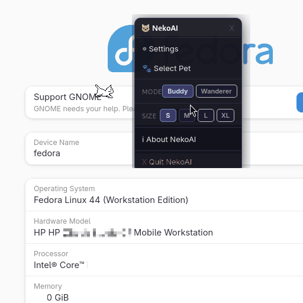 |     |

---

## 📏 Pet size

Pixel-perfect S / M / L / XL scaling (32 / 64 / 96 / 128 px). Sizes are
integer multiples of the native 32 px sprite so the rendering stays
crisp at every scale.

| Fedora                                                                   |
| ------------------------------------------------------------------------ |
| 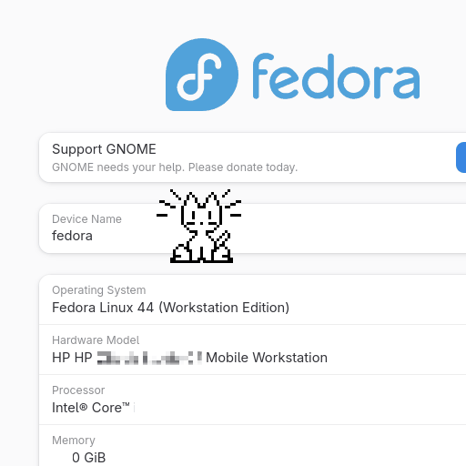 |

---

## ⚙️ Settings

Pick AI provider, paste an API key, switch model. The connection badge
(🟢 connected / 🟡 untested / 🔴 disconnected) reflects the live state
of the configured provider.

| macOS                                                            |
| ---------------------------------------------------------------- |
| 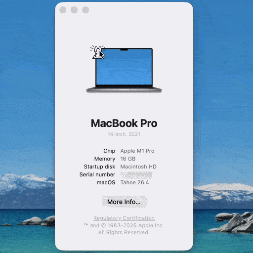 |

---

## 🖥️ Cross-platform overview

The pet roaming, idling, and reacting on each desktop.

| macOS                                                            | Ubuntu (Linux)                                                     |
| ---------------------------------------------------------------- | ------------------------------------------------------------------ |
| 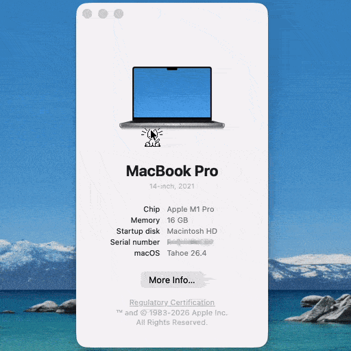 | 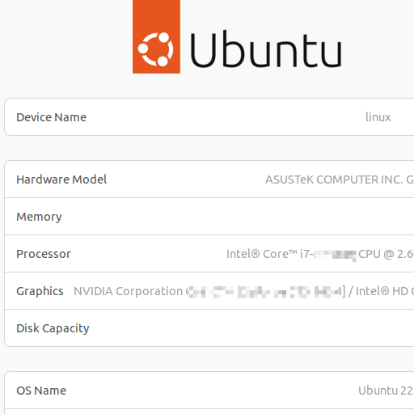 |

---

← Back to the [README](../README.md)
